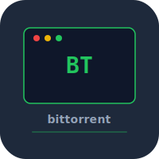

# bittorrent


BitTorrent client built from scratch in Rust. Bencode parser, tracker protocol, peer wire protocol, piece management, and disk I/O.

## Build

```bash
cargo build --release
./target/release/bittorrent download file.torrent
```

## Test

```bash
cargo test
```

## License

MIT 2026 Joshua Trommel
